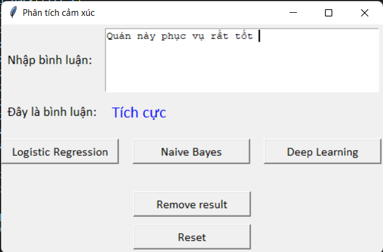

# Sentiment Analysis Vietnamese

## Files
```
.
├── Data                  
│   └── ...
├── Model                   
│   └── ...
├── prep.ipynb                  # Preprocessing pipeline
├── Logistic Regression.ipynb   # Implement Logistic Regression
├── NaiveBayes.ipynb            # Implement Naive Bayes
├── prep.py                     # Preprocessing file (to import)
├── DL.py                       # Implement Deep learning (Word2Vec + CNN)
└── ...   
```

## Install Dependencies
```sh
$ pip install -r requirements.txt
```

## Run app
```sh
$ python app.py
```
## Accuracy
| Logistic regression | Naive bayes | Deep learning (W2V + CNN) |
|:-------------------:|:-----------:|:-------------------------:|
|        81.99%       |    85.14%   |           88.4%           |

## UI

